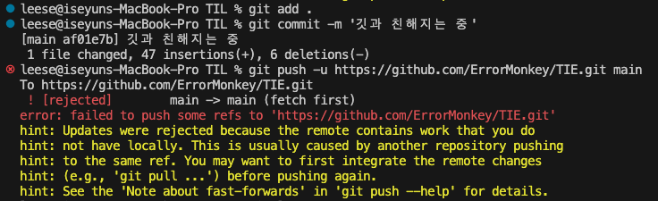
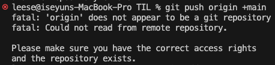

데브 코테 문제를 연습했다. 난이도 낮은 문제들도 왜 이렇게 어렵냐...


#### Spread syntax
```javascript
(...Obj)
```
처음 보고 당황했는데 알면 알수록 편하고 신기한 녀석. <a href="https://noritersand.github.io/javascript/javascript-전개-구문-spread-syntax/" target="_blank">잘 정리된 깃헙 블로그</a>


## git 에러

깃 푸시를 하는 과정에서 처음 보는 에러를 만났다. 나중에 정리해서 옮길 겸 기록.
### 이유
깃허브 저장소에 설명란에 적어둔 게 README.md에 나오는데 이게 깃을 사용하는 폴더의 README.md랑 내용이 달라 충돌된다고 알려주는 것.
### 해결
두 가지 방법이 있다.
- 저장소를 당겨와서 싱크를 맞추기 `git pull`
- 강제로 푸시해서 깃헙 저장소를 덮어버리기 `git push origin +<저장소 이름>`


밀어버리려고 푸시했는데 원격 저장소를 연결을 안 해놨다...

`git remote -v`로 원격 저장소 확인하고  
`git remote remove <이름>` 문제 있으면 삭제  
`git remote add origin <깃헙주소.git>` 다시 연결

그냥 내가 멍청해서 생긴 해프닝~