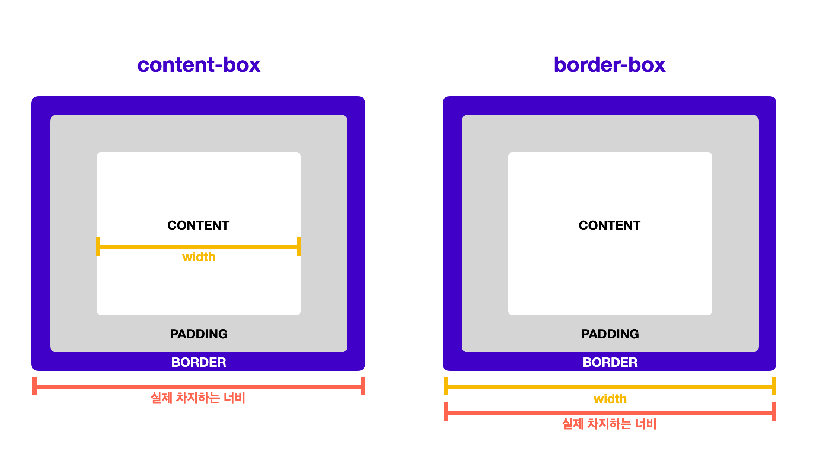

# SW021 day-1


```css
:nth-child(2n)
/* 짝수 자식 요소 선택하기 */
:nth-child(2n+1)
/* 홀수 자식 요소 선택하기 */

box-sizing: border-box;
/* width 같은 사이즈가 콘텐트만 적용되고 패딩, 보더 사이즈 등을 따로 합쳐서 박스 사이즈를 계산하는 걸
   width가 실제 박스 사이즈에 적용되도록 도와주는 명령어*/

```

